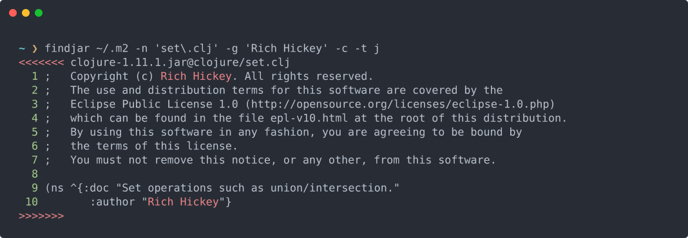

# findjar

> **Like `grep`, but it sees inside your jars, zips, and tarballs.**

[](https://github.com/mbjarland/findjar/actions/workflows/ci.yml)
[](https://github.com/mbjarland/findjar/releases/latest)
[](https://github.com/mbjarland/findjar/releases)
[](https://www.eclipse.org/legal/epl-2.0/)
[](https://clojure.org)
[](https://www.graalvm.org)

Search files on disk **and inside jar, zip, and tar archives**
(`.tar` / `.tar.gz` / `.tgz`) — including nested jars-inside-jars
(Spring Boot fatjars, uberjars, shaded clients). Regex match on file
name, path, or content. Compute hashes, extract manifests, dump
archives, pipe to `jq` — all at **~22ms cold start** as a native
binary.

<p align="center">
  
</p>

---

## See it in 10 seconds

```text
$ findjar ~/.m2 -n core.clj -g "Rich Hickey" -t j -x 1
.../clojure-1.11.1.jar@clojure/set.clj 9   (ns ^{:doc "Set ops..."
.../clojure-1.11.1.jar@clojure/set.clj:10        :author "Rich Hickey"}
.../clojure-1.11.1.jar@clojure/set.clj 11        clojure.set)
...

$ findjar app.jar --nested -n MANIFEST.MF
app.jar@BOOT-INF/lib/spring-core-6.1.0.jar@META-INF/MANIFEST.MF
app.jar@BOOT-INF/lib/jackson-core-2.16.1.jar@META-INF/MANIFEST.MF
app.jar@BOOT-INF/classes/META-INF/MANIFEST.MF

$ findjar ~/.m2 --find-by-hash sha1:8b86d29c79f3d34d5dba0c50f0c8e6abf6e9b41a
~/.m2/.../clojure-1.9.0.jar@clojure/core.clj
~/.m2/.../clojure-1.9.0/clojure-1.9.0-sources.jar@clojure/core.clj
```

That's the whole pitch. **Read on if any of those scratched an itch
you've been ignoring with `for jar in $(find ...); do unzip -p ... | grep ...; done`.**

---

## Install

### Homebrew (macOS, Linux) — recommended

```bash
brew install mbjarland/tap/findjar
```

Pulls a prebuilt platform-native binary, the man page, and shell
completions. Done in about a second.

### Precompiled binary

Download for your platform from
[the latest release](https://github.com/mbjarland/findjar/releases/latest)
and put `findjar` on `$PATH`. Available for `linux-x64`,
`macos-arm64` (Apple Silicon; Intel macs run it via Rosetta 2),
and `windows-x64`.

### From source (any platform)

```bash
clj -T:build uber                 # → target/findjar-<v>-standalone.jar
java -jar target/findjar-*-standalone.jar --help
```

For the ~30× faster native binary, install Oracle GraalVM 25
(`sdk install java 25.0.3-graal`) and run:

```bash
GRAALVM_HOME=$HOME/.sdkman/candidates/java/25.0.3-graal \
  clj -T:build native-image
```

See [`doc/RELEASING.md`](doc/RELEASING.md) for the full build pipeline.

---

## Why findjar?

You probably already use one of these. Here's where each falls short:

| You currently use | Limitation findjar removes |
|---|---|
| **`grep -r`** | Can't see inside jar/zip/tar archives. |
| **`zgrep` / `zcat \| grep`** | Treats a `.tar.gz` as one opaque stream — no per-entry results, no idea which file inside matched. |
| **`unzip -p` ‖ `for f in $(find ...); do …`** | Verbose, fragile, no parallelism, no nested-jar recursion. |
| **`jar -tf` ‖ `unzip -l`** | Lists entries but can't grep their content. |
| **`rg` (ripgrep)** | Native to text files; archive support is bolted on (and slower). |
| **IDE search across libraries** | Locks you into the IDE; not scriptable / pipeline-able. |

findjar is built specifically for the JVM-developer workflow:
*"where the heck does this class actually come from on my classpath,
and what version is it?"* — but the archive-aware grep core is just
as useful for tarballs, distro packages, Python wheels' source
dists, and anywhere else you want per-entry results across compressed
or bundled content.

---

## Highlights

🔍 **Searches archive interiors** — `.jar` and `.zip` are first-class.
`--nested` recurses into jars inside jars (uberjars, Spring Boot
fatjars, Bazel/Pants bundles).

🎯 **Regex everywhere** — file name, path, content; or use globs
(`-G '*.clj'`) when regex feels heavy. `-w` for word-boundary;
`-v` to invert.

⚡ **Grep-like content search** — line numbers, intra-line ANSI
highlighting, asymmetric context (`-A` / `-B` / `-x`), `--count`,
`--max-count`.

🐚 **Shell-script friendly** — `-q` for exit-code-only; `-l` to print
just paths (pipe to `xargs $EDITOR`); `--output json` for `jq`.

🔢 **Five hash algorithms** — `md5`, `sha1`, `sha256`, `sha512`,
`crc32`. Compute several at once, or use `--find-by-hash` to locate
every copy of a file by its digest (great for tracking down which
library shipped a particular class).

📦 **Beyond jar/zip** — also reads inside `.tar`, `.tar.gz`, `.tgz`
archives (`-t t`).

📜 **`--manifest`** — for each matched jar, dump `META-INF/MANIFEST.MF`
and any `pom.properties` without you having to know the exact path.

☕ **`--class-info`** — parse `.class` entries via ASM and print the
class name, access modifiers, super, interfaces, and method
signatures. Combines with `--output json` for *"list every class that
implements Serializable"* pipelines.

🏎️ **Fast startup, parallel scan** — ~22ms cold start as a native
binary; parallel by default with `--parallel-jobs N` and
`--no-parallel` knobs. Output is byte-for-byte identical to the
serial path.

🧠 **Smart defaults** — defaults to `.` if no root given, accepts
multiple roots, skips `.git` / `node_modules` / `target` / `build` /
etc., honors `.gitignore` and `NO_COLOR`, doesn't follow symlinks,
skips binary files when grepping. Override any of them with one flag.

📚 **Documented** — embedded `--examples`, man page, shell
completions for zsh / bash / fish via `findjar --completions <shell>`.

---

## Usage at a glance

Each example shows the output you'd actually get. ANSI coloring is
not reproduced here but appears on a TTY.

**Search the current directory for files containing `TODO`** —
default action is grep; output is `path:line text` (grep-compatible):

```text
$ findjar -g TODO
src/foo.clj:42  ;; TODO: refactor this
src/bar.clj:17  ;; TODO: explain the heuristic
test/foo_test.clj:9   ;; TODO: cover the ipv6 case
```

**Glob match against file names**:

```text
$ findjar -G '*.clj'
build.clj
src/findjar/cli.clj
src/findjar/core.clj
...
```

**Grep across a maven cache, jar entries only, with 1-line context**:

```text
$ findjar ~/.m2 -n clj -g 'Rich Hickey' -t j -x 1
.../clojure-1.11.1.jar@clojure/set.clj 9   (ns ^{:doc "Set ops..."
.../clojure-1.11.1.jar@clojure/set.clj:10        :author "Rich Hickey"}
.../clojure-1.11.1.jar@clojure/set.clj 11        clojure.set)
```

(Lines using `:` are hits; lines using a space separator are context.)

**Files-only — print just the paths of matching files** (pipe to your editor):

```text
$ findjar . -g TODO -l
src/foo.clj
src/bar.clj
test/foo_test.clj

$ findjar . -g TODO -l | xargs $EDITOR    # opens all three at once
```

**Cat a manifest from inside a jar** — line-numbered, with `<<<<<<<` / `>>>>>>>` framing so cat blocks for several files don't run together:

```text
$ findjar ~/.m2 -n MANIFEST.MF -c -t j
<<<<<<< .../clojure-1.11.1.jar@META-INF/MANIFEST.MF
   1  Manifest-Version: 1.0
   2  Created-By: Apache Maven
   3  Main-Class: clojure.main
   4
>>>>>>>
```

**Compute multiple hashes in one go** — output is `<hex> <algo> <path>` so multi-algo results are unambiguous:

```text
$ findjar ~/.m2 -n string.clj -t j -s sha1 -s md5
ce2bcdc1...  sha1  .../clojure-1.11.1.jar@clojure/string.clj
8b86d29c...  sha1  .../clojure-1.9.0.jar@clojure/string.clj
9c3a418e...  md5   .../clojure-1.11.1.jar@clojure/string.clj
1b2dcf8f...  md5   .../clojure-1.9.0.jar@clojure/string.clj
```

**Find every copy of a known file by sha1**:

```text
$ findjar ~/.m2 --find-by-hash sha1:8b86d29c79f3d34d5dba0c50f0c8e6abf6e9b41a
~/.m2/repository/.../clojure-1.9.0.jar@clojure/core.clj
~/.m2/repository/.../clojure-1.9.0-sources.jar@clojure/core.clj
```

**Recurse into nested archives** (uberjars, Spring Boot fatjars) — paths use the `outer.jar@inner.jar@entry` form:

```text
$ findjar app.jar --nested -n MANIFEST.MF
app.jar@BOOT-INF/lib/spring-core-6.1.0.jar@META-INF/MANIFEST.MF
app.jar@BOOT-INF/lib/jackson-core-2.16.1.jar@META-INF/MANIFEST.MF
app.jar@META-INF/MANIFEST.MF
```

**Dump every matched jar's manifest** with one flag (`--manifest` is sugar for `-c` on MANIFEST.MF / pom.properties entries):

```text
$ findjar app.jar --manifest --nested
<<<<<<< app.jar@META-INF/MANIFEST.MF
   1  Manifest-Version: 1.0
   2  Main-Class: com.example.Main
   3  Spring-Boot-Version: 3.2.1
>>>>>>>
<<<<<<< app.jar@BOOT-INF/lib/spring-core-6.1.0.jar@META-INF/MANIFEST.MF
   1  Manifest-Version: 1.0
   2  Bundle-Name: spring-core
   ...
>>>>>>>
```

**Class structure via ASM** — name, super, interfaces, method signatures:

```text
$ findjar ~/.m2 -t j -n DataSource.class --class-info
<<<<<<< .../spring-jdbc-6.1.0.jar@.../DataSource.class
class:      org.springframework.jdbc.datasource.DataSource
access:     public, abstract, interface
extends:    java.lang.Object
implements: javax.sql.DataSource
methods:
  public abstract getConnection()Ljava/sql/Connection;
  public abstract getConnection(Ljava/lang/String;Ljava/lang/String;)Ljava/sql/Connection;
>>>>>>>
```

**Quiet shell-script mode** — no output, exit code 0 if any match, 1 otherwise:

```bash
$ findjar . -n config.edn -q && echo found
found
$ findjar . -n probably-not-here -q || echo "missing"
missing
```

**JSON output for jq** — one JSON Lines record per call:

```text
$ findjar . -g TODO --output json | head -2
{"kind":"grep","path":"src/foo.clj","line":42,"hit?":true,"text":"  ;; TODO: refactor this","matches":[[5,9]]}
{"kind":"grep","path":"src/bar.clj","line":17,"hit?":true,"text":"  ;; TODO: explain the heuristic","matches":[[5,9]]}

$ findjar . -g TODO --output json | jq -s 'group_by(.path) | map({(.[0].path): length})'
[{"src/foo.clj":1},{"src/bar.clj":1},{"test/foo_test.clj":1}]
```

**Multiple search roots** — paths include the root prefix so they're unambiguous:

```text
$ findjar ~/.m2 ~/.gradle -g 'CVE-' --parallel-jobs 4 --no-gitignore
/Users/me/.m2/repository/.../some-old-lib.jar@META-INF/CVE-2021-44228.txt
/Users/me/.gradle/caches/.../another-lib.jar@CHANGELOG:42  fixed CVE-2023-something
```

`findjar --help` for the full option list (grouped: Filtering /
Action / Output / Scanning / Misc). `findjar --examples` for a
richer worked set (with ANSI coloring on a TTY).

---

## Output format

Default text output is grep-like and stable for shell scripting:

```text
<path>:<line>  <content>           # grep hit
<path> <line>  <content>           # context line (no colon)
<hex> <algo> <path>                # hash
<<<<<<< <path>                     # cat block start
   1  ...                          # cat content with line numbers
>>>>>>>                            # cat block end
```

JSON output (`--output json`) emits one JSON Lines (`jsonl`) record
per call:

```json
{"kind":"match","path":"src/foo.clj"}
{"kind":"grep","path":"src/foo.clj","line":42,"hit?":true,"text":"...","matches":[[4,8]]}
{"kind":"hash","path":"x.jar@y.clj","algo":"sha1","hex":"abc123..."}
{"kind":"count","path":"src/foo.clj","count":7}
```

Suitable for piping into `jq`, building editor integrations, or
feeding an LLM. See `findjar --examples` for `jq` workflow snippets.

---

## Defaults that just do the right thing

| Default | Override |
|---|---|
| `findjar` with no root → search `.` | give one or more `<search-root>` args |
| Multiple roots accepted | n/a |
| Skip `.git`, `.svn`, `.hg`, `.bzr`, `node_modules`, `target`, `build`, `.gradle`, `.cpcache`, `.idea`, `.vscode` | `--all` to traverse everything; `--exclude NAME` to add to skip list |
| Honor `.gitignore` at search-root | `--no-gitignore` |
| **Don't** follow symlinks | `-L` / `--follow` |
| Skip binary files when grepping (NUL-byte sniff) | `--text` |
| Honor `NO_COLOR` env var | `-m` / `--monochrome` to disable ANSI explicitly |
| ANSI stripped on non-TTY stdout (pipe / redirect) | `FORCE_COLOR=1` to force ANSI passthrough (for `less -R`, asciinema, etc.) |
| Errors → stderr (exit non-zero); help / version → stdout (exit 0) | n/a |
| Parallel scan (~ cores+2 workers) | `--parallel-jobs N` to cap; `--no-parallel` for serial |
| Hash output: `<hex> <algo> <path>` so multi-algo is parseable | n/a |

---

## Shell completions

Embedded in the binary:

```bash
findjar --completions zsh  > ~/.zfunc/_findjar
findjar --completions bash > /etc/bash_completion.d/findjar
findjar --completions fish > ~/.config/fish/completions/findjar.fish
```

Homebrew also installs them to `$(brew --prefix)/share/{zsh,bash,fish}-completion`
automatically. Reload your shell, then `findjar -<TAB>` enumerates
flags, `findjar -t <TAB>` shows type selectors (n j z), `findjar -s <TAB>`
lists hash algorithms.

For oh-my-zsh: drop the file under
`~/.oh-my-zsh/custom/plugins/findjar/_findjar` and add `findjar` to
the `plugins=(...)` line in `~/.zshrc`, or simply pipe the output to
any directory already on your zsh `$fpath`.

---

## Documentation

| Doc | Topic |
|---|---|
| [`doc/HELP.txt`](doc/HELP.txt) | flag reference, grouped by category (snapshot of `findjar --help`) |
| [`doc/EXAMPLES.txt`](doc/EXAMPLES.txt) | worked examples for every feature (snapshot of `findjar --examples`) |
| [`man/findjar.1`](man/findjar.1) | full man page (groff source; `man ./man/findjar.1` to render) |
| [`CHANGELOG.md`](CHANGELOG.md) | what changed in each release |
| [`doc/RELEASING.md`](doc/RELEASING.md) | build / release pipeline |
| [`doc/TODO.md`](doc/TODO.md) | roadmap |
| [`CLAUDE.md`](CLAUDE.md) | repo orientation for contributors |

The first two are static snapshots, regenerated by the release pipeline
(`clj -T:build snapshot-docs`). For the always-current versions, run
`findjar --help` or `findjar --examples` locally — they ship inside the
binary.

---

## License

Eclipse Public License v2.0 — see [LICENSE](LICENSE).

## Author

Matias Bjarland · [mbjarland@gmail.com](mailto:mbjarland@gmail.com)

If `findjar` saves you time, ⭐ the repo. Bug reports and PRs welcome
at [github.com/mbjarland/findjar/issues](https://github.com/mbjarland/findjar/issues).
